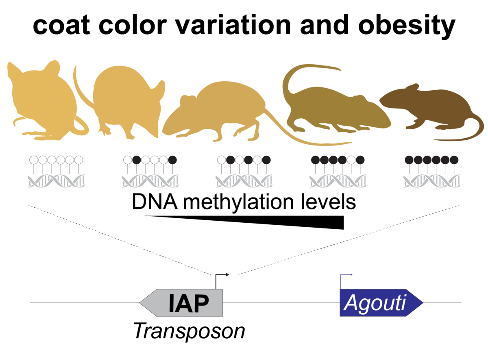
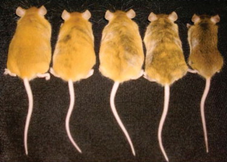

---

output:
  xaringan::moon_reader:
    seal: false
    css: ["xaringan-themer.css", "iframe.css"]
    nature:
      countdown: 30000
      highlightLines: true

---

class: inverse, center, middle
background-image: url(pictures/jumper.jpg)
background-size: cover

```{r xaringan-themer, include = FALSE}
library(xaringanthemer)
mono_accent_inverse(base_color = "#3C989E")
```

### <code><font color="red">Transposons in Neuropsychiatric Disease</font></code>
##### <code><font color="red">[Brian Muchmore | UVM Psychiatry | 08/29/2019]</font></code>

---

class: center, middle

# TE = Transposable Element

# Transposable Element = TE

---

background-image: url(pictures/barb.jpg)
background-position: 50% 95%
background-size: 25%

# A Brief History of Transposons

* In the late 1940s, Barbara McClintock discover a chromosome-breaking locus in maize that could change its position within a chromosome...jumping genes!

* Although maize geneticists kept it real and were not too sexist, it took some time before others understood the funk was not fake. On the hostility and delayed recognition she faced:
  >"It didn’t bother me, I just knew I was right."

* She won an *unshared* Nobel Prize in Physiology or Medicine in 1983.

---

<iframe src="https://profiles.nlm.nih.gov/ps/access/LLBBBK.pdf" style="position:fixed; top:0; left:0; bottom:0; right:0; width:100%; height:100%; border:none; margin:0; padding:0; overflow:hidden; z-index:999999;">
    Your browser doesn't support iframes
</iframe>

---

background-image: url(pictures/ten_things.jpg)
background-position: 50% 95%
background-size: 60%

# TEs do a lot

* Retrotransposons mobilize through a ‘copy-and-paste’ mechanism.

* DNA transposons are mobilized via a ‘cut-and-paste’ mechanism.

---

background-image: url(pictures/corn.jpg)
background-position: 50% 95%
background-size: 57%

> The genome may be viewed as an ecosystem inhabited by diverse communities of TEs, which seek to propagate and multiply through sophisticated interactions with each other and with other components of the cell. These interactions encompass processes familiar to ecologists, such as parasitism, cooperation, and competition. Thus, it is perhaps not surprising that TEs are rarely, if ever, randomly distributed in the genome. TEs exhibit various levels of preference for insertion within certain features or compartments of the genome. These are often guided by opposite selective forces, a balancing act of facilitating future propagation while mitigating deleterious effects on host cell function.

---

background-image: url(pictures/evolution.png)
background-position: 50% 95%
background-size: 57%

# Evolution

Transposition is a potent mechanism of genome expansion and mutagenicity:
  + Half of *D. melanogaster* phenotypic mutants are caused by TEs.
  + TEs account for 10–15% of all inherited mutant phenotypes in mice.
  
---

# The Agouti Phenomenon

.pull-left[

]

.pull-right[

]

* By the way, TEs not only to propagate vertically but also horizontally between individuals and species i.e. between host species, pathogens and parasites.

---

# Structural Importance

* TEs can promote genomic structural variation long after they have lost the capacity to mobilize:

  + Transposition causes genome rearrangement.
  
  + TE microhomology predispose to template switching during repair of replication errors.
  
  + Recombination events can occur between the highly homologous regions dispersed by related TEs at distant genomic positions.
  
  + TEs also play a role in V(D)J recombination (via *Rag1* and *Rag2*), telomere maintenance and centromere stability.

# To reiterate, half our genome are TEs

---

<iframe src="http://genome.ucsc.edu/cgi-bin/hgTracks?db=hg38&lastVirtModeType=default&lastVirtModeExtraState=&virtModeType=default&virtMode=0&nonVirtPosition=&position=chr11%3A113393171%2D113491833&hgsid=752310671_wve8LZluWxwvDTshZdqJIyyCR77q" style="position:fixed; top:0; left:0; bottom:0; right:0; width:100%; height:100%; border:none; margin:0; padding:0; overflow:hidden; z-index:999999;">
    Your browser doesn't support iframes
</iframe>

---

<iframe src="https://www.cell.com/neuron/fulltext/S0896-6273(13)01005-2" style="position:fixed; top:0; left:0; bottom:0; right:0; width:100%; height:100%; border:none; margin:0; padding:0; overflow:hidden; z-index:999999;">
    Your browser doesn't support iframes
</iframe>

---

# In 2009...

* It was shown that TEs are particularly abundant in human stem cells in the brain that become neurons.
	+ Furthermore, the TEs were shown to play an important role in regulating neuronal development and proliferation. 
	
	+ At this time, it was recognized that TEs played an important role in Rett syndrome, a form of autism and Louis-Bar syndrome (a neurological motor disease).
	

# In 2014...

* The link between TEs and schizophrenia was established:

  + Extracted DNA from the neurons of deceased schizophrenics were compared to healthy people and there was a 1.1-fold increase in TEs in schizophrenics.
  
  + Injected pregnant mice with a chemical that simulates viral infection had Offspring higher levels of TEs in their brain tissue. 
	
  + Exposed infant macaques to a hormone associated with increased schizophrenia risk and the grown macaques had higher levels of TEs.
	
---

background-image: url(pictures/inheritance.jpg)
background-position: 50% 95%
background-size: 28%

# The Specific Takeaways

* Established environmental triggers for schizophrenia caused genetic changes in real-time via TEs.

* TEs are more active in the brain of patients with neuropsychiatric diseases.

* Correlation is not causation but the mechanism seems clear.

* TEs likely provide vibrant cognitive diversity:
	+ Helps humans respond to changing environmental conditions.
	+ Contributes to extraordinary intellectual outliers.
	+ Also contributes to schizophrenia.

---

<iframe src="https://www.cell.com/cell/fulltext/S0092-8674(17)31504-0" style="position:fixed; top:0; left:0; bottom:0; right:0; width:100%; height:100%; border:none; margin:0; padding:0; overflow:hidden; z-index:999999;">
    Your browser doesn't support iframes
</iframe>

---

> The ability of a cell to sense these broken ends, to direct them towards each other, and then to unite them so that the union of the two DNA strands is correctly oriented, is a particularly revealing example of the sensitivity of cells to all that is going on within them. They make wise decisions and act on them.

> -Barbara McClintock

.pull-left[

]

.pull-right[

]

---

# References

* Barbara McClintock. **Controlling elements and the gene.** *Cold Spring Harb Symp Quant Biol.* 1956

* Sandeep Ravindran. **Barbara McClintock and the discovery of jumping genes.** *PNAS.* 2012

* Guillaume Bourque et. al. **Ten things you should know about transposable elements.** *Genome Biology.* 2018

* Özgen Deniz et. al. **Regulation of transposable elements by DNA modifications.** *Nature Reviews Genetics.* 2019

* Nicole G. Coufal et. al. **L1 retrotransposition in human neural progenitor cells.** *Nature.* 2009

* Miki Bundo et. al. **Increased L1 Retrotransposition in the Neuronal Genome in Schizophrenia.** *Neuron* 2014

* Schizophrenia Working Group of the Psychiatric Genomics Consortium. **Biological insights from 108 schizophrenia-associated genetic loci.** *Nature.* 2014

---

# References Continued

* Masaki Nishioka et. al. **Somatic mutations in the human brain: implications for psychiatric research.** *Molecular Psychiatry.* 2019

* Richard G. Hunter et. al. **Stress and the dynamic genome: Steroids, epigenetics, and the transposome.** *PNAS.* 2014

* Pastuzyn ED et. al. **The Neuronal Gene Arc Encodes a Repurposed Retrotransposon Gag Protein that Mediates Intercellular RNA Transfer.** *Cell.* 2018


